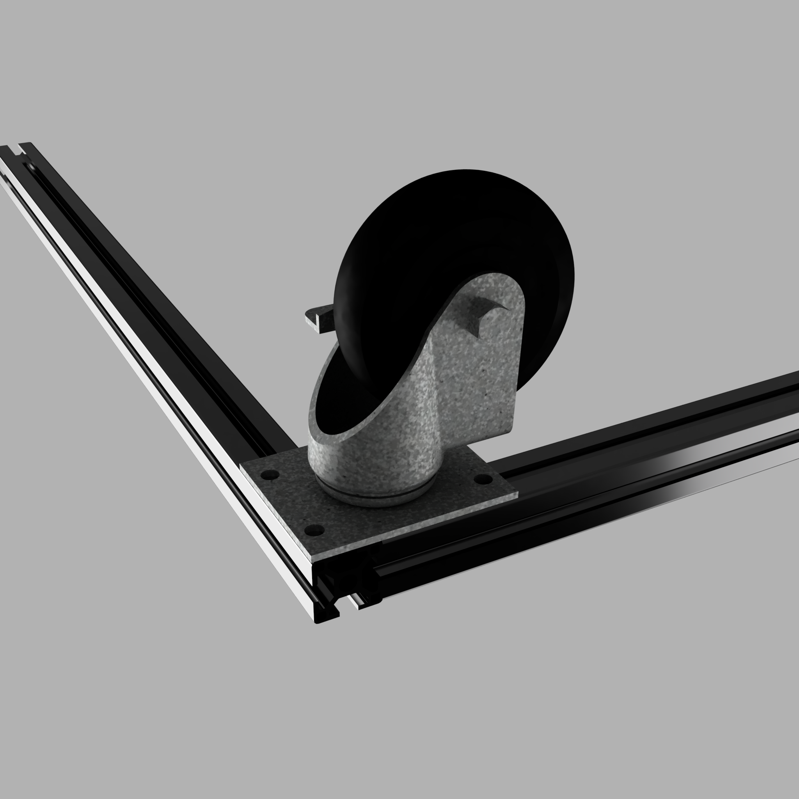
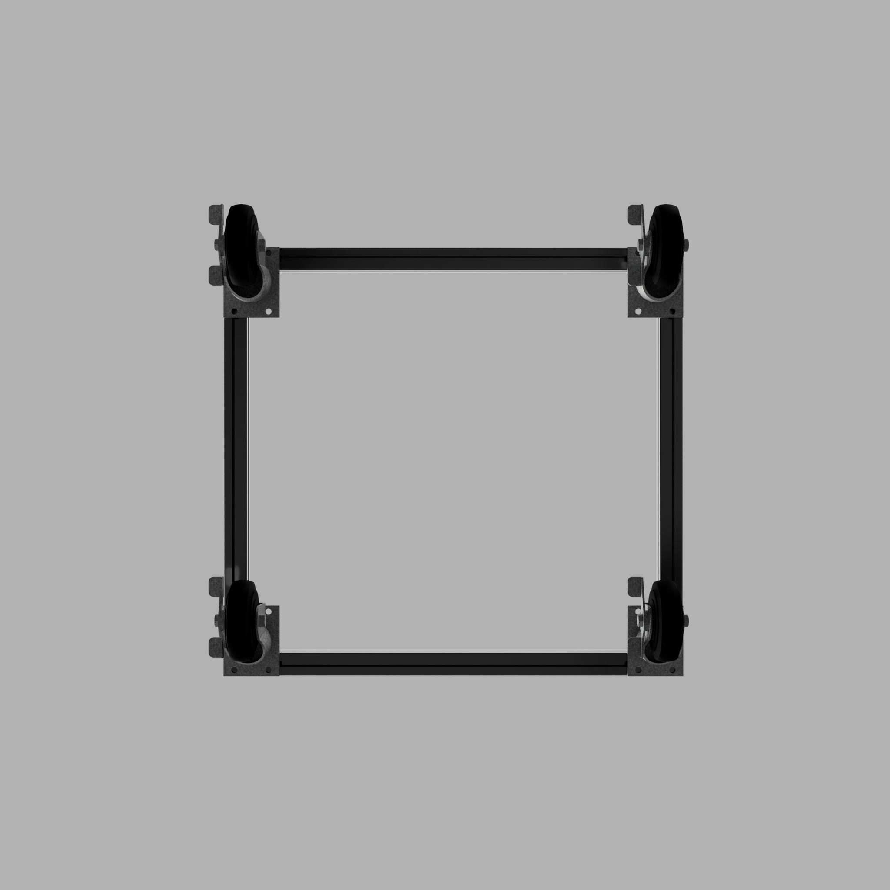
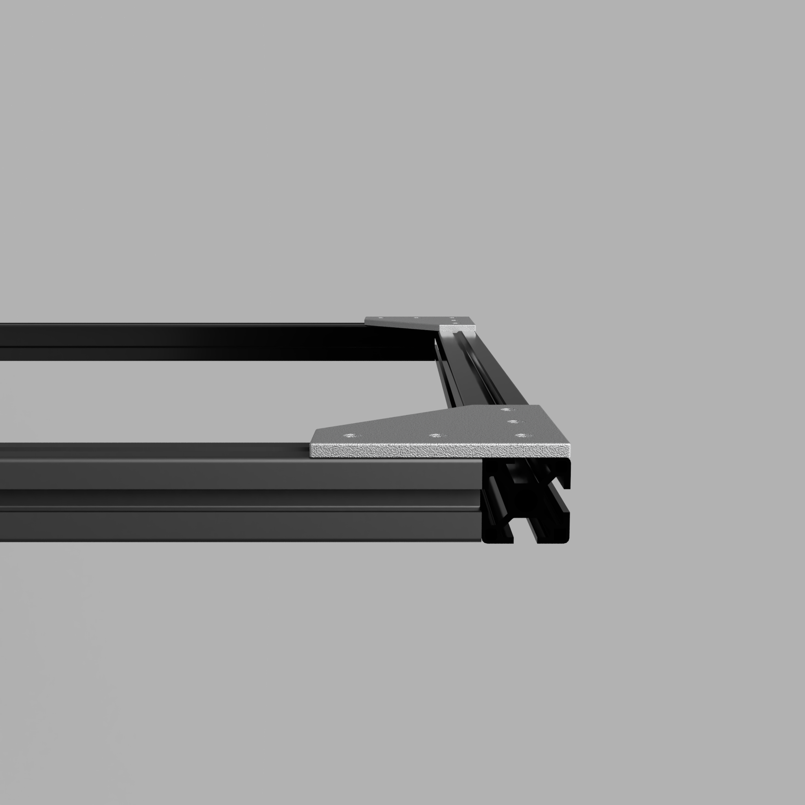
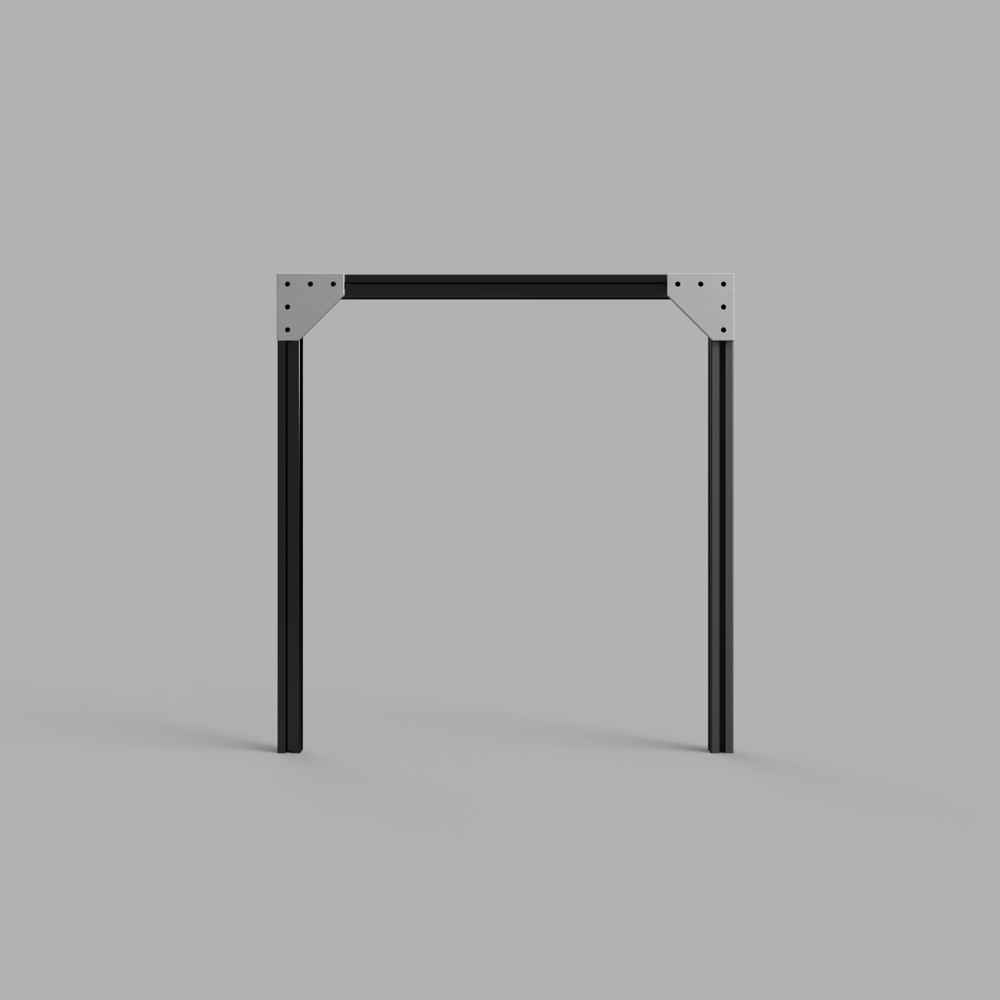
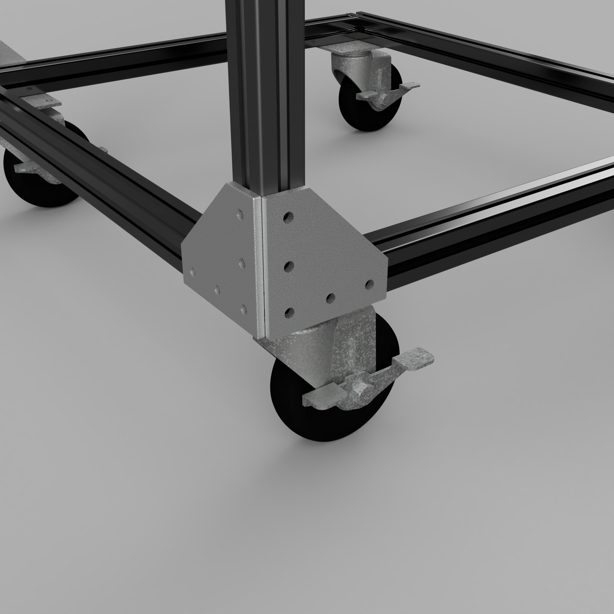
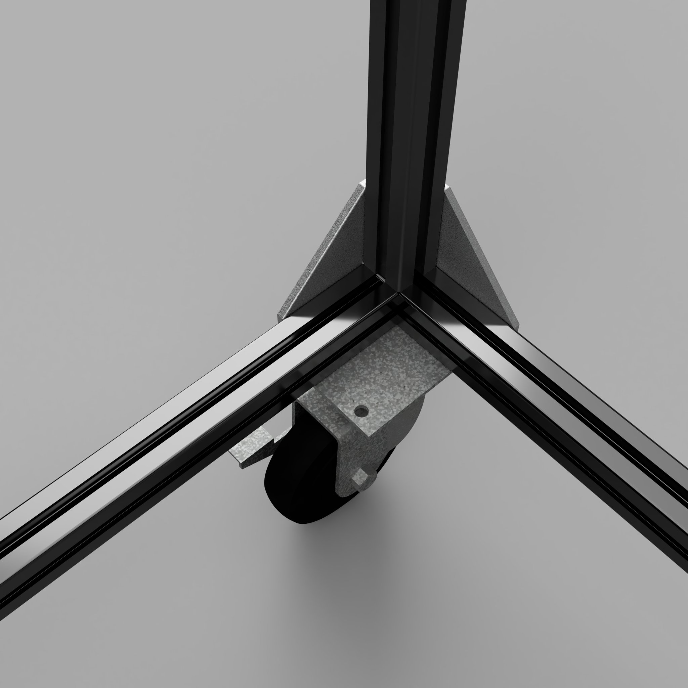
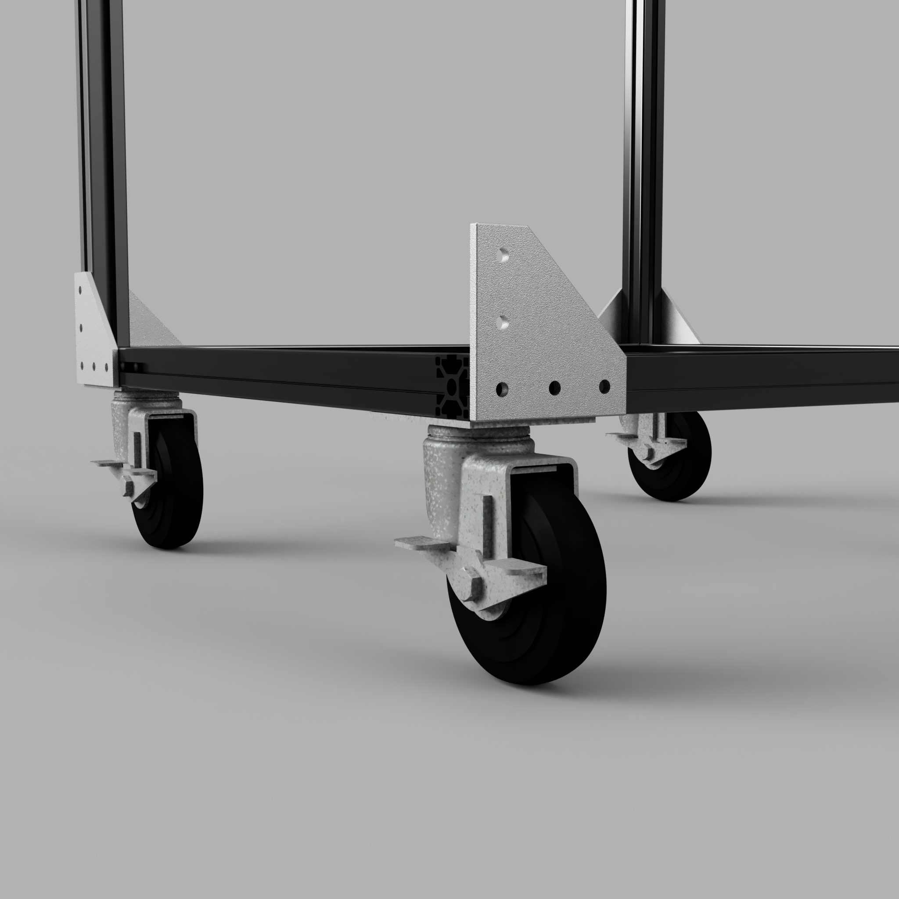

# Assembly Instructions

Refer to the [CAD](CAD) diagrams for detailed part orientation.

## Bottom frame assembly

Attach the casters to two 500mm extrusions (SG-102) and two 600mm extrusions (SG-101) as shown in the CAD diagram.  Use three drop nuts (SG-203), washers (SG-202), and M6 x 10mm screws (SG-201).

## Handle Assembly

Assemble the handle using three 600mm extrusions (SG-101) and two joining plates (SG-103) as shown in the CAD diagram.  Use drop nuts (SG-203) and M6 x 10mm (SG-201) screws to attach the joining plates.

## Handle to Frame

Attach four joining plates (SG-103) to the bottom frame as shown in the CAD Diagram.  Then attach the handle to the four joining plates.  Use drop nuts (SG-203) an M6 x 10mm screws (SG-201) to attach the joining plates.

## Finishing Touches

1. Attach two joining plates (SG-103) to outside rail of the frame.  These plates keep the plywood from sliding off.

