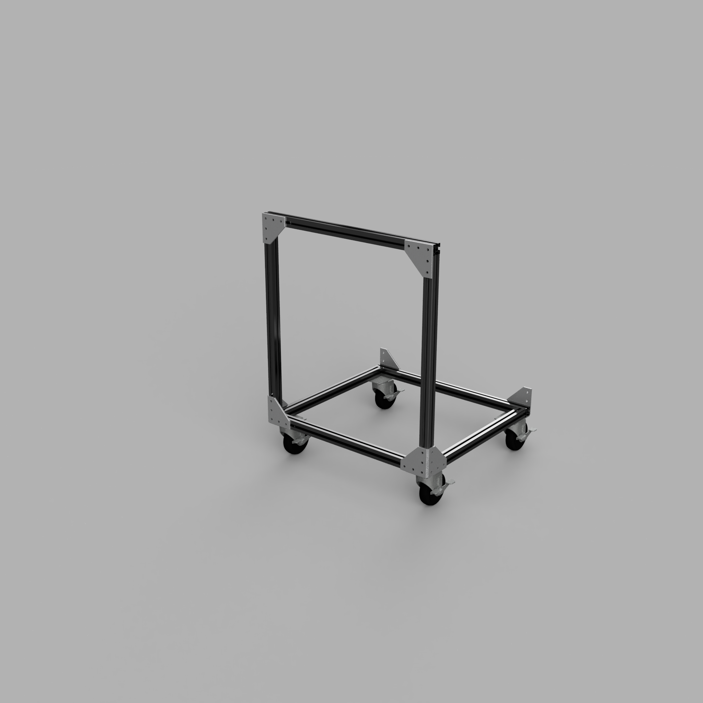

# Sheet Goods Cart

This cart is designed to mange quarter sheets as well as larger cutoffs in a small shop.  It is composed of commodity aluminum extrusions, casters, and joining plates.  It is not designed to hold full 4x8 sheets.

Please use the [latest released version](https://github.com/cwimmer/sheet-goods-cart/releases/latest).  The main branch might have partial changes committed.

## Tools and Skills required

- Metric hex wrenches
- Large square
- Metric ruler (600mm or longer)

## Table of Contents

- [Readme](README.md) - This file
- [Bill of Materials](BOM.md) - Specifications of parts included in this assembly
- [Assembly Instructions](ASSEMBLY.md) - Assembly Instructions
- [Changelog](CHANGELOG.md) - Chronologically ordered list of notable changes for each version of a project
- [Material Defaults](MATERIAL_DEFAULTS.md) - Descriptions of materials where not otherwise specified.
- [On Suppliers](ON_SUPPLIERS.md) - Discussion of how to source parts for this assembly
- [Acknowledgements](ACKNOWLEDGEMENTS.md) - Acknowledgements of other authors included either for reference or inspiration

## General Notes

1. Unless otherwise specified, dimensions are in millimeters.
2. The CAD diagrams in the CAD directory are the authoritative definition of this assembly.

## License

Unless otherwise noted:

- **All written content and images:** © Charles Wimmer, licensed under [Creative Commons Attribution 4.0 International](https://creativecommons.org/licenses/by/4.0/).
- **All hardware design files (e.g., STL, CAD, PCB):** Licensed under the [CERN Open Hardware License v2 – Strongly Reciprocal](https://ohwr.org/cern_ohl_s_v2.txt).
- **All code and scripts:** Licensed under the [MIT License](https://opensource.org/licenses/MIT).
